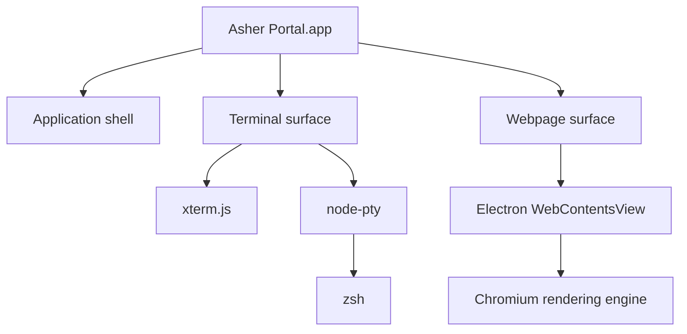

<p align="center">
  
</p>

<h1 align="center">Asher Portal</h1>

<p align="center">
  <strong>A real terminal with live webpages built directly into the same window.</strong>
</p>

<p align="center">
  Type a URL like a command. Open the live page. Keep your terminal underneath.
</p>

<p align="center">
  <a href="https://github.com/ashermenachem/asher-portal/releases/latest">
    
  </a>
  
  
  <a href="LICENSE">
    
  </a>
</p>

---

## Enter a URL. Open a portal.

Asher Portal combines a genuine `zsh` terminal with a live Chromium webpage surface inside one desktop application.

```text
ashermenachem@Mac ~ % apple.com
```

The website opens directly above the terminal.

No separate browser window. No special webpage command. Your shell session stays alive while you move between terminal-only, split-screen, and full-page modes.

## Install in one line

Paste this into the regular macOS Terminal:

```bash
curl -fsSL https://raw.githubusercontent.com/ashermenachem/asher-portal/main/install.sh | bash
```

The installer automatically:

- detects Apple Silicon or Intel
- downloads the correct prebuilt release
- verifies its SHA-256 checksum
- installs `Asher Portal.app` into `~/Applications`
- creates the global `portal` launcher
- adds `~/.local/bin` to your shell path when needed
- launches Asher Portal

**No Node.js, npm, Electron, Xcode, Homebrew, or developer tools are required to install the app.**

<details>
<summary><strong>Inspect the installer before running it</strong></summary>

Running any remote shell script requires trust. Download and inspect it first:

```bash
curl -fsSL \
  https://raw.githubusercontent.com/ashermenachem/asher-portal/main/install.sh \
  -o asher-portal-install.sh

less asher-portal-install.sh
bash asher-portal-install.sh
```

</details>

## Launch

```bash
portal
```

You can also open **Asher Portal** from `~/Applications` or Spotlight.

## Open webpages naturally

Inside Asher Portal, type a domain directly:

```text
apple.com
```

```text
youtube.com
```

```text
github.com
```

Local development servers work too:

```text
localhost:3000
```

```text
127.0.0.1:5173
```

Full URLs remain supported:

```text
https://example.com/path
```

## Controls

| Action | Control |
|---|---|
| Open a webpage | Type its address and press Return |
| Expand the webpage | Click `⤢` |
| Return to split view | Press <kbd>Esc</kbd> |
| Close the webpage pane | Click `×` |
| Close using the keyboard | <kbd>Command</kbd> + <kbd>W</kbd> |
| Quit Asher Portal | <kbd>Command</kbd> + <kbd>Q</kbd> |
| Launch again | Run `portal` |

Closing or resizing a webpage does not reset the terminal. Your working directory, history, running processes, and active shell session remain intact.

## Why Asher Portal is different

<table>
  <tr>
    <td width="50%">
      <h3>Real terminal</h3>
      <p>A genuine login <code>zsh</code> session connected through a pseudoterminal—not a simulated command prompt.</p>
    </td>
    <td width="50%">
      <h3>Live webpages</h3>
      <p>Real Chromium-rendered HTML, CSS, JavaScript, animation, audio, and standard web video.</p>
    </td>
  </tr>
  <tr>
    <td width="50%">
      <h3>URLs become commands</h3>
      <p>Enter <code>apple.com</code> as naturally as entering <code>pwd</code> or <code>git status</code>.</p>
    </td>
    <td width="50%">
      <h3>One continuous workspace</h3>
      <p>Move between terminal-only, split, and webpage-focused layouts without losing your shell session.</p>
    </td>
  </tr>
</table>

## How it works



Asher Portal is its own product and visual identity. Electron, Chromium, xterm.js, and node-pty are underlying implementation technologies.

## Privacy and security

Asher Portal is not an anonymity system, VPN, tracking blocker, or private-browsing guarantee.

Websites may make network requests, store site data, and use tracking technologies as they can in other Chromium-based environments. Only open webpages and run commands that you trust.

Some websites may restrict DRM-protected video, embedded authentication, autoplay, or hardware-protected media.

## Requirements

- macOS 13 or newer
- Apple Silicon (`arm64`) or Intel (`x64`)
- internet access during installation
- `zsh`, included with supported macOS versions

## Uninstall

```bash
curl -fsSL https://raw.githubusercontent.com/ashermenachem/asher-portal/main/uninstall.sh | bash
```

## Development

Development requires Node.js 22 or newer.

```bash
git clone https://github.com/ashermenachem/asher-portal.git
cd asher-portal
npm install
npm start
```

Build an unpacked local app:

```bash
npm run build:mac
```

Build release archives manually:

```bash
npm run build:release:arm64
npm run build:release:x64
```

## Releases

GitHub Actions builds Apple Silicon and Intel archives whenever a version tag such as `v1.0.0` is pushed.

Published assets:

```text
Asher-Portal-macOS-arm64.zip
Asher-Portal-macOS-arm64.zip.sha256
Asher-Portal-macOS-x64.zip
Asher-Portal-macOS-x64.zip.sha256
```

The installer chooses and verifies the correct archive automatically.

## License

> [!IMPORTANT]
> **Asher Portal is public source-available software. It is not open source.**

The source may be viewed for evaluation, education, and security inspection. Without prior written permission, it may not be copied, redistributed, rebranded, commercialized, or modified into another product.

Providing attribution does not grant permission.

Read the complete [Asher Portal Proprietary Source License](LICENSE).

## Creator

Created by **Asher Menachem**.

<p align="center">
  <strong>Enter a URL. Open a portal.</strong>
</p>
