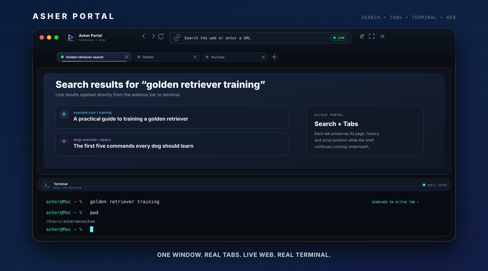
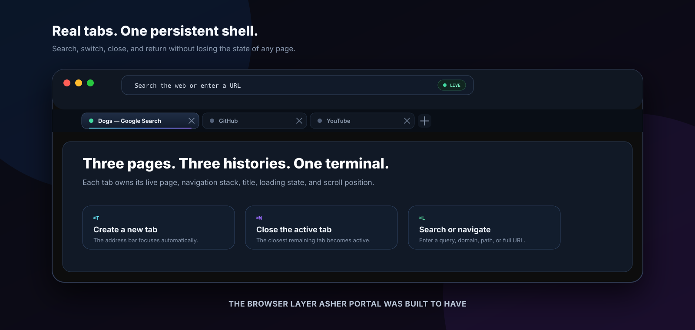
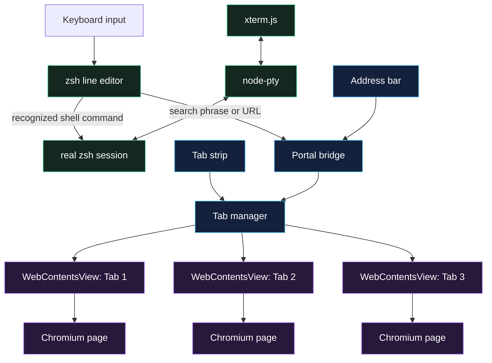

<div align="center">



<br>

# Asher Portal

### **A real browser and a real terminal, fused into one continuous workspace.**

Search the internet, open websites, keep several live tabs, and run ordinary shell commands without leaving the same window.

<br>

[](https://github.com/ashermenachem/asher-portal/releases/latest)
[](https://github.com/ashermenachem/asher-portal/releases)
[](#requirements)
[](#requirements)
[](LICENSE)

<br>

[**Download the latest release**](https://github.com/ashermenachem/asher-portal/releases/latest)
&nbsp;&nbsp;•&nbsp;&nbsp;
[**Install in one line**](#install)
&nbsp;&nbsp;•&nbsp;&nbsp;
[**Explore version 1.1**](#version-110)

</div>

---

## Version 1.1.0

Version 1.1 turns the original terminal preview concept into a genuine terminal-first browser.

### New in this release

- **A completely redesigned professional interface**
- **Real persistent browser tabs**
- **Internet search from the address bar or terminal**
- **Back, forward, reload, expand, close, and external-browser controls**
- **A live address bar with page title and URL synchronization**
- **Independent page history and scroll position for every tab**
- **Loading indicators, page status, app version, and architecture information**
- **Keyboard shortcuts for new tabs, closing tabs, and focusing the address bar**



---

## The idea

A normal browser pushes the terminal into another window. A normal terminal treats everything that is not a command as an error.

Asher Portal does something different.

### Search from the terminal

```text
asher@Mac ~ % golden retriever training
```

That text opens as an internet search in the active browser tab.

### Open a website directly

```text
asher@Mac ~ % github.com
```

GitHub opens as a live webpage above the same shell.

### Run a real shell command

```text
asher@Mac ~ % pwd
/Users/ashermenachem
```

Recognized shell commands still execute normally.

### Move between several live pages

Press <kbd>Command</kbd> + <kbd>T</kbd>, open another site, and switch tabs without losing the previous page, its navigation history, or its scroll position.

---

## Install

Paste this into the regular macOS Terminal:

```bash
curl -fsSL https://raw.githubusercontent.com/ashermenachem/asher-portal/main/install.sh | bash
```

The installer automatically:

- detects Apple Silicon or Intel
- downloads the correct prebuilt release
- verifies the published SHA-256 checksum
- installs `Asher Portal.app` into `~/Applications`
- creates the global `portal` launcher
- adds `~/.local/bin` to your shell path when needed
- launches Asher Portal

**Node.js, npm, Electron, Xcode, Homebrew, and developer tools are not required to install a release.**

### Launch

```bash
portal
```

You can also open **Asher Portal** from Spotlight or `~/Applications`.

### Upgrade

Run the same installer again:

```bash
curl -fsSL https://raw.githubusercontent.com/ashermenachem/asher-portal/main/install.sh | bash
```

<details>
<summary><strong>Inspect the installer before running it</strong></summary>

```bash
curl -fsSL \
  https://raw.githubusercontent.com/ashermenachem/asher-portal/main/install.sh \
  -o asher-portal-install.sh

less asher-portal-install.sh
bash asher-portal-install.sh
```

</details>

> [!NOTE]
> The current public build is not Apple-notarized. The installer verifies the GitHub Release checksum before installation and removes the downloaded app's quarantine attribute.

---

## Search or navigate

The top address bar behaves like a modern browser omnibox.

### Search

```text
dogs
```

```text
best restaurants in Los Angeles
```

```text
how to center a div
```

Text that does not look like a web address becomes a Google search.

### Domains and paths

```text
apple.com
```

```text
github.com/ashermenachem/asher-portal
```

```text
instagram.com/ashermenachem
```

### Local development

```text
localhost:3000
```

```text
127.0.0.1:5173
```

### Full URLs

```text
https://example.com/path?mode=portal#section
```

---

## Tabs

Every tab owns its own live `WebContentsView`.

That means each tab preserves:

- its current page
- navigation history
- page title
- loading state
- scroll position
- in-page state that remains active while the tab exists

Links that request a new browser window open as a new Asher Portal tab.

### Tab controls

| Action | Control |
|---|---|
| Create a new tab | <kbd>Command</kbd> + <kbd>T</kbd> or click `+` |
| Close the active tab | <kbd>Command</kbd> + <kbd>W</kbd> |
| Close a specific tab | Click its `×` button |
| Switch tabs | Click a tab |
| Focus the address bar | <kbd>Command</kbd> + <kbd>L</kbd> |
| Search or navigate | Enter text and press Return |

---

## Browser controls

| Action | Control |
|---|---|
| Go back | Back arrow |
| Go forward | Forward arrow |
| Reload | Reload button |
| Open in the default browser | External-link button |
| Expand the webpage | Expand button or <kbd>Command</kbd> + <kbd>Shift</kbd> + <kbd>P</kbd> |
| Restore split view | <kbd>Esc</kbd> |
| Close the active portal tab | Close button or <kbd>Command</kbd> + <kbd>W</kbd> |
| Quit Asher Portal | <kbd>Command</kbd> + <kbd>Q</kbd> |

---

## Why it feels different

<table>
  <tr>
    <td width="50%" valign="top">
      <h3>Real terminal</h3>
      <p>A genuine login <code>zsh</code> session connected through a pseudoterminal—not a simulated command box.</p>
    </td>
    <td width="50%" valign="top">
      <h3>Real browser tabs</h3>
      <p>Each tab has its own Chromium webpage surface, navigation stack, and persistent page state.</p>
    </td>
  </tr>
  <tr>
    <td width="50%" valign="top">
      <h3>Search is native</h3>
      <p>Type a normal search phrase into the terminal or address bar. URLs still open directly.</p>
    </td>
    <td width="50%" valign="top">
      <h3>One continuous workspace</h3>
      <p>The shell remains alive while you search, browse, switch tabs, resize panes, and expand pages.</p>
    </td>
  </tr>
  <tr>
    <td width="50%" valign="top">
      <h3>Professional browser chrome</h3>
      <p>A branded title bar, omnibox, navigation controls, live status, tab strip, and loading feedback.</p>
    </td>
    <td width="50%" valign="top">
      <h3>Built for local development</h3>
      <p>Open localhost projects directly while continuing to run servers and commands underneath.</p>
    </td>
  </tr>
</table>

---

## Under the surface



### Core technologies

| Layer | Technology |
|---|---|
| Desktop application | Electron |
| Browser tabs | Multiple `WebContentsView` instances |
| Web rendering | Chromium |
| Terminal rendering | xterm.js |
| Pseudoterminal | node-pty |
| Shell | macOS `zsh` |
| Packaging | electron-builder |
| Release builds | GitHub Actions |

---

## Current capabilities

- [x] professional custom browser interface
- [x] real interactive `zsh` terminal
- [x] live Chromium webpages
- [x] Google search from ordinary text
- [x] direct domains, paths, ports, queries, fragments, and full URLs
- [x] persistent multi-tab browsing
- [x] separate history and page state per tab
- [x] back, forward, and reload controls
- [x] split-screen and full-page modes
- [x] localhost and local-development support
- [x] Apple Silicon release
- [x] Intel release
- [x] SHA-256 verified one-line installer
- [x] automated GitHub Release builds

## Direction

Ideas being explored for later releases:

- [ ] saved-page offline vault
- [ ] bookmarks and richer history
- [ ] recently closed tabs
- [ ] tab restoration between launches
- [ ] download management
- [ ] built-in update notifications
- [ ] additional platforms

> [!IMPORTANT]
> A browser cannot retrieve a live page it has never downloaded while the computer has no network connection. An offline feature can reopen pages saved in advance, but live feeds, messages, logins, new posts, and remote server data still require a network.

---

## Privacy, security, and honest limitations

Asher Portal is **not** a VPN, anonymity network, tracking blocker, or private-browsing guarantee.

A website opened in Asher Portal can generally:

- make network requests
- store cookies and site data
- use analytics and tracking technology
- identify the device or account as it could in another Chromium environment

Only open websites and execute terminal commands that you trust.

Some services may restrict:

- DRM-protected media
- embedded authentication
- hardware-protected playback
- autoplay
- behavior inside embedded browser surfaces

Security reports should follow [`SECURITY.md`](SECURITY.md).

---

## Requirements

| Requirement | Supported |
|---|---|
| Operating system | macOS 13 or newer |
| Apple Silicon | Yes — `arm64` |
| Intel Mac | Yes — `x64` |
| Shell | `zsh` |
| Internet during installation | Required |
| Node.js for normal installation | Not required |

---

## Build from source

Development requires Node.js 22 or newer.

```bash
git clone https://github.com/ashermenachem/asher-portal.git
cd asher-portal
npm install
npm start
```

Build an unpacked Apple Silicon application:

```bash
npm run build:mac
```

Build release archives manually:

```bash
npm run build:release:arm64
npm run build:release:x64
```

> [!WARNING]
> This repository is public for source inspection, education, evaluation, and security review. Its custom license does not grant permission to create or distribute rebranded or derivative versions.

---

## Releases

Every version tag triggers GitHub Actions to build both Mac architectures and publish:

```text
Asher-Portal-macOS-arm64.zip
Asher-Portal-macOS-arm64.zip.sha256
Asher-Portal-macOS-x64.zip
Asher-Portal-macOS-x64.zip.sha256
```

The installer detects the current architecture and verifies the matching checksum automatically.

[**View all releases →**](https://github.com/ashermenachem/asher-portal/releases)

---

## Uninstall

```bash
curl -fsSL https://raw.githubusercontent.com/ashermenachem/asher-portal/main/uninstall.sh | bash
```

---

## License

> [!IMPORTANT]
> **Asher Portal is source-available. It is not open source.**

Official, unmodified releases may be installed and used for personal, non-commercial use under the terms of the license.

Without prior written permission, the source may not be copied, redistributed, rebranded, commercialized, or modified into another product. Attribution alone does not grant permission.

Read the complete [Asher Portal Proprietary Source License](LICENSE).

---

<div align="center">

### Created by **Asher Menachem**

**Search it. Open it. Tab it. Keep the terminal.**

<br>

[](https://github.com/ashermenachem/asher-portal)
[](https://github.com/ashermenachem/asher-portal/releases/latest)

</div>
