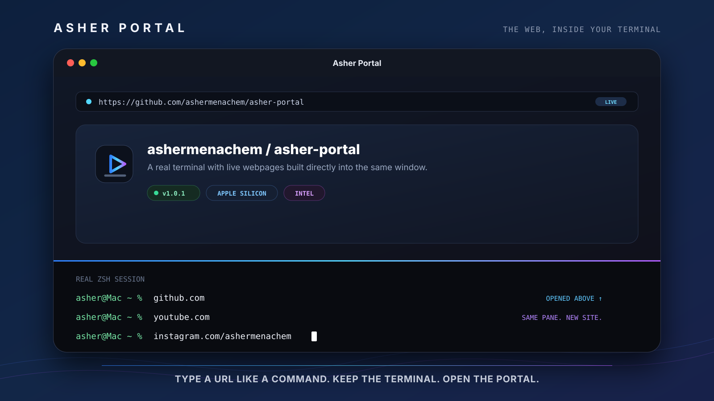
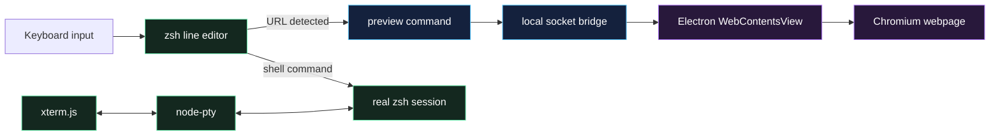

<div align="center">



<br>

# Asher Portal

### **The terminal is no longer where the web stops. It is where the web opens.**

Type a website like a command. Asher Portal renders the live page above your real shell, keeps the terminal active underneath, and lets you jump to the next site without closing anything.

<br>

[](https://github.com/ashermenachem/asher-portal/releases/latest)
[](https://github.com/ashermenachem/asher-portal/releases)
[](#requirements)
[](#requirements)
[](LICENSE)

<br>

[**Download the latest release**](https://github.com/ashermenachem/asher-portal/releases/latest)
&nbsp;&nbsp;•&nbsp;&nbsp;
[**Install in one line**](#-install)
&nbsp;&nbsp;•&nbsp;&nbsp;
[**See how it works**](#-how-it-feels)

</div>

---

## ⚡ The idea

A browser normally lives in a separate window. A terminal normally stops at text.

**Asher Portal removes that wall.**

```text
asher@Mac ~ % github.com
```

GitHub opens in the live webpage pane.

```text
asher@Mac ~ % youtube.com
```

The same pane moves directly to YouTube—no closing the page, no browser tab, and no `preview` prefix.

```text
asher@Mac ~ % instagram.com/ashermenachem
```

Paths, queries, fragments, local development URLs, and full `https://` addresses work too.

> [!TIP]
> Think of the URL as a native shell command. Type it, press Return, and the portal moves.

---

## ✨ Why it feels different

<table>
  <tr>
    <td width="50%" valign="top">
      <h3>⌨️ URLs are commands</h3>
      <p>Enter <code>apple.com</code>, <code>github.com/user/repo</code>, or <code>localhost:3000</code> directly into the terminal.</p>
    </td>
    <td width="50%" valign="top">
      <h3>🌐 The webpage is real</h3>
      <p>Pages run through Chromium with live HTML, CSS, JavaScript, animation, audio, and standard web video.</p>
    </td>
  </tr>
  <tr>
    <td width="50%" valign="top">
      <h3>🧠 Your shell stays alive</h3>
      <p>Your working directory, history, environment, processes, and genuine login <code>zsh</code> session remain intact.</p>
    </td>
    <td width="50%" valign="top">
      <h3>↗️ Continuous navigation</h3>
      <p>Leave one website open and type another domain underneath. The same portal switches instantly.</p>
    </td>
  </tr>
  <tr>
    <td width="50%" valign="top">
      <h3>🧪 Built for local development</h3>
      <p>Open <code>localhost:3000</code>, <code>127.0.0.1:5173</code>, or another local server without leaving your workspace.</p>
    </td>
    <td width="50%" valign="top">
      <h3>📦 One-command installation</h3>
      <p>The installer detects Apple Silicon or Intel, verifies the release checksum, installs the app, and creates the <code>portal</code> launcher.</p>
    </td>
  </tr>
</table>

---

## 🚀 Install

Paste one line into the regular macOS Terminal:

```bash
curl -fsSL https://raw.githubusercontent.com/ashermenachem/asher-portal/main/install.sh | bash
```

That command:

- detects `arm64` or `x64`
- downloads the correct prebuilt application
- verifies the published SHA-256 checksum
- installs `Asher Portal.app` into `~/Applications`
- creates the global `portal` command
- adds `~/.local/bin` to your shell path when needed
- launches Asher Portal

**You do not need Node.js, npm, Electron, Xcode, Homebrew, or developer tools to install the release.**

### Launch

```bash
portal
```

You can also open **Asher Portal** from Spotlight or `~/Applications`.

### Upgrade

Run the same installer again:

```bash
curl -fsSL https://raw.githubusercontent.com/ashermenachem/asher-portal/main/install.sh | bash
```

It replaces the old application with the latest release while preserving the launcher.

<details>
<summary><strong>Inspect the installer before running it</strong></summary>

Executing a remote shell script requires trust. Download and inspect it first:

```bash
curl -fsSL \
  https://raw.githubusercontent.com/ashermenachem/asher-portal/main/install.sh \
  -o asher-portal-install.sh

less asher-portal-install.sh
bash asher-portal-install.sh
```

</details>

> [!NOTE]
> The current public build is not Apple-notarized. The installer verifies the GitHub Release checksum before installation and removes the downloaded app's quarantine attribute.

---

## 🎬 How it feels

Start the app:

```bash
portal
```

Then use the terminal naturally:

```text
github.com
youtube.com
instagram.com/ashermenachem
localhost:3000
https://example.com/path?mode=portal#section
```

| What you do | What Asher Portal does |
|---|---|
| Type a domain | Opens it in the webpage pane |
| Type another domain while a page is open | Reuses the same pane and navigates immediately |
| Type a path, query, or fragment | Opens the exact destination |
| Run a normal shell command | Sends it to the real `zsh` session |
| Close the webpage | Expands the terminal without resetting it |
| Expand the webpage | Temporarily gives the site the full window |
| Press <kbd>Esc</kbd> | Returns from full-page mode to split view |

### Keyboard and window controls

| Action | Control |
|---|---|
| Open or switch websites | Type the address and press Return |
| Expand the webpage | Click `⤢` or press <kbd>Command</kbd> + <kbd>Shift</kbd> + <kbd>P</kbd> |
| Restore split view | Press <kbd>Esc</kbd> |
| Close the webpage pane | Click `×` or press <kbd>Command</kbd> + <kbd>W</kbd> |
| Quit Asher Portal | Press <kbd>Command</kbd> + <kbd>Q</kbd> |

---

## 🧬 Under the surface



### Core technologies

| Layer | Technology |
|---|---|
| Desktop application | Electron |
| Live webpage pane | Chromium through `WebContentsView` |
| Terminal rendering | xterm.js |
| Real pseudoterminal | node-pty |
| Shell | macOS `zsh` |
| Native packaging | electron-builder |
| Releases | GitHub Actions |

Asher Portal has its own name, product design, interaction model, and visual identity. Electron, Chromium, xterm.js, and node-pty are implementation technologies underneath it.

---

## ✅ What exists today

- [x] real interactive `zsh` terminal
- [x] live Chromium webpage pane
- [x] direct domain entry
- [x] paths, queries, fragments, ports, and full URLs
- [x] continuous site-to-site navigation
- [x] localhost and local development support
- [x] split-screen and full-page modes
- [x] Apple Silicon release
- [x] Intel release
- [x] SHA-256 verified one-line installer
- [x] automatic GitHub Release builds

## 🛰️ Direction

Ideas being explored for future releases:

- [ ] saved-page offline vault for pages downloaded in advance
- [ ] history and bookmarks
- [ ] back and forward navigation
- [ ] download management
- [ ] built-in update notifications
- [ ] additional platforms

> [!IMPORTANT]
> A browser cannot retrieve a live page it has never downloaded when the computer has no network connection. An offline mode can reopen pages saved in advance, but live feeds, messages, logins, new posts, and remote server data still require a network.

---

## 🔐 Privacy, security, and honest limitations

Asher Portal is **not** a VPN, anonymity network, tracking blocker, or private-browsing guarantee.

A website opened in Asher Portal can generally:

- make network requests
- store cookies and site data
- use analytics and tracking technology
- identify the device or account as it could in another Chromium environment

Only open websites and execute terminal commands that you trust.

Some services may restrict:

- DRM-protected media
- embedded authentication
- hardware-protected playback
- autoplay
- behavior inside embedded browser surfaces

Security reports should follow [`SECURITY.md`](SECURITY.md).

---

## 💻 Requirements

| Requirement | Supported |
|---|---|
| Operating system | macOS 13 or newer |
| Apple Silicon | Yes — `arm64` |
| Intel Mac | Yes — `x64` |
| Shell | `zsh` |
| Internet during installation | Required |
| Node.js for normal installation | Not required |

---

## 🛠️ Build from source

Development requires Node.js 22 or newer.

```bash
git clone https://github.com/ashermenachem/asher-portal.git
cd asher-portal
npm install
npm start
```

Build an unpacked Apple Silicon application:

```bash
npm run build:mac
```

Build release archives manually:

```bash
npm run build:release:arm64
npm run build:release:x64
```

> [!WARNING]
> This repository is public for source inspection, education, evaluation, and security review. Its custom license does not grant permission to create or distribute rebranded or derivative versions.

---

## 📡 Releases

Every version tag triggers GitHub Actions to build both Mac architectures and publish:

```text
Asher-Portal-macOS-arm64.zip
Asher-Portal-macOS-arm64.zip.sha256
Asher-Portal-macOS-x64.zip
Asher-Portal-macOS-x64.zip.sha256
```

The one-line installer detects the current architecture and verifies the matching checksum automatically.

[**View all releases →**](https://github.com/ashermenachem/asher-portal/releases)

---

## 🗑️ Uninstall

```bash
curl -fsSL https://raw.githubusercontent.com/ashermenachem/asher-portal/main/uninstall.sh | bash
```

This removes the application, command launcher, and Asher Portal application data.

---

## 📜 License

> [!IMPORTANT]
> **Asher Portal is source-available. It is not open source.**

Official, unmodified releases may be installed and used for personal, non-commercial use under the terms of the license.

Without prior written permission, the source may not be copied, redistributed, rebranded, commercialized, or modified into another product. Attribution alone does not grant permission.

Read the complete [Asher Portal Proprietary Source License](LICENSE).

---

<div align="center">

### Created by **Asher Menachem**

**Enter a URL. Open a portal.**

<br>

[](https://github.com/ashermenachem/asher-portal)
[](https://github.com/ashermenachem/asher-portal/releases/latest)

</div>
